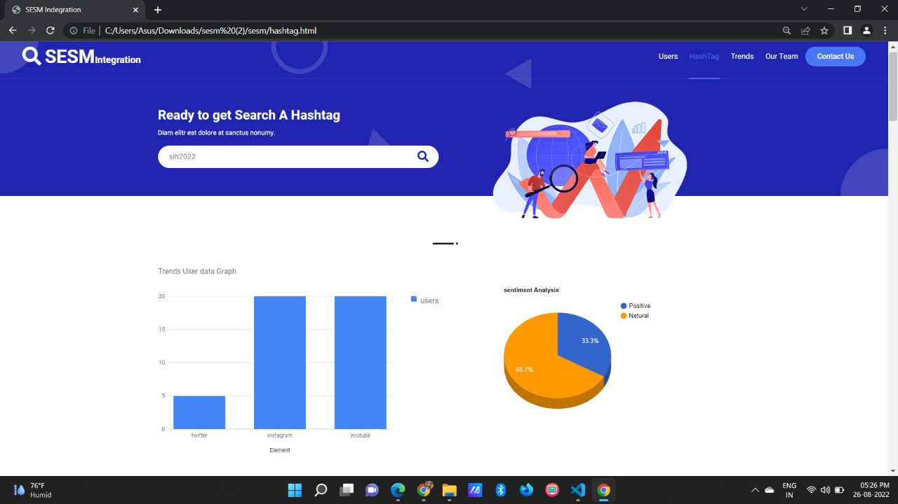
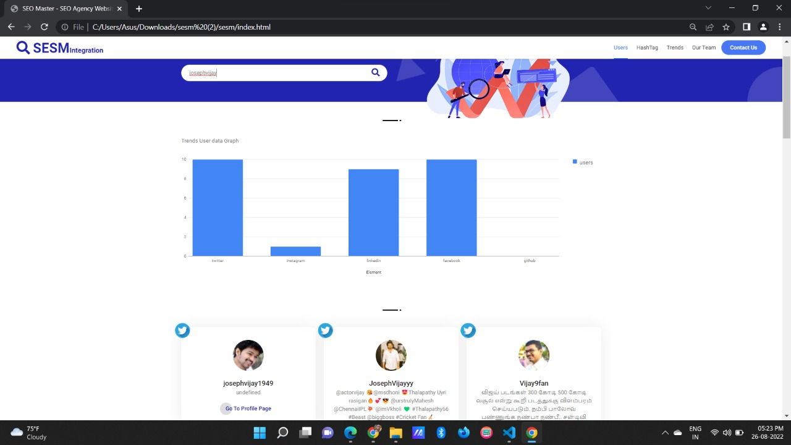

# social-media-search-engine
Title: Social Media Search Engine: Connecting the Dots in the Digital World

# Introduction:

In today's interconnected digital landscape, social media platforms have become an integral part of our lives, enabling us to connect, share, and discover information. However, with the abundance of social media platforms available, it can be challenging to keep track of relevant content across multiple channels. This is where a social media search engine comes into play, serving as a centralized platform to access resources spread across various social media networks.

What is a Social Media Search Engine?

A social media search engine is a specialized platform designed to aggregate, index, and provide search functionalities for content shared on various social media platforms. It aims to streamline the process of finding information across multiple networks, enabling users to search for specific topics, keywords, hashtags, or user-generated content, all in one place.

Features and Functionality:

1. Cross-Platform Aggregation: A social media search engine integrates with popular social media platforms such as Facebook, Twitter, Instagram, LinkedIn, YouTube, and more. It continuously scans and aggregates content from these networks, providing users with a unified search experience.

2. Advanced Search Capabilities: Users can perform targeted searches by specifying keywords, hashtags, usernames, or combinations thereof. The search engine employs algorithms to analyze and rank content based on relevance, recency, popularity, or other criteria, ensuring the most accurate and up-to-date results.

3. Filtering and Sorting: To refine search results, social media search engines offer various filters, such as content type (text, images, videos), date range, location, language, and user demographics. Additionally, sorting options allow users to prioritize results based on relevance, engagement, or other parameters.

4. Real-Time Updates: The search engine constantly updates its index to reflect the latest content across social media platforms. Users can access real-time information, ensuring they stay informed about trending topics, breaking news, and relevant conversations.

5. Personalization and User Profiles: Social media search engines can provide personalized experiences by allowing users to create profiles and save their preferences. This feature enables customized recommendations, personalized feeds, and the ability to follow specific topics or users.

# Benefits and Impact:

1. Time and Effort Efficiency: With a social media search engine, users no longer need to individually visit multiple platforms to find information. They can save time and effort by accessing content from various social media networks in one centralized location.

2. Comprehensive Insights: By aggregating content from different platforms, the search engine provides a comprehensive overview of conversations, trends, and user-generated content. This helps users gain valuable insights into public opinion, sentiment analysis, and emerging topics.

3. Discoverability and Reach: Content creators and businesses can benefit from increased discoverability and reach by leveraging social media search engines. Their content becomes more accessible to a wider audience, allowing for greater engagement and potential collaborations.

4. Simplified Research and Analysis: Researchers, journalists, and marketers can utilize social media search engines to monitor trends, track public opinion, conduct market research, and perform sentiment analysis. The centralized platform streamlines the data collection and analysis process, facilitating informed decision-making.

5. User Empowerment: Social media search engines empower users by providing them with a comprehensive view of information, irrespective of the platform it originates from. This helps combat information silos, misinformation, and enhances transparency in the digital sphere.

# Screenshots

# Conclusion:

A social media search engine serves as a valuable tool in today's digital age, simplifying the process of accessing and exploring content across various social media platforms. By aggregating information, offering advanced search functionalities, and providing real-time updates, these engines facilitate efficient information discovery, analysis, and engagement. Whether for personal use, professional research, or business.

